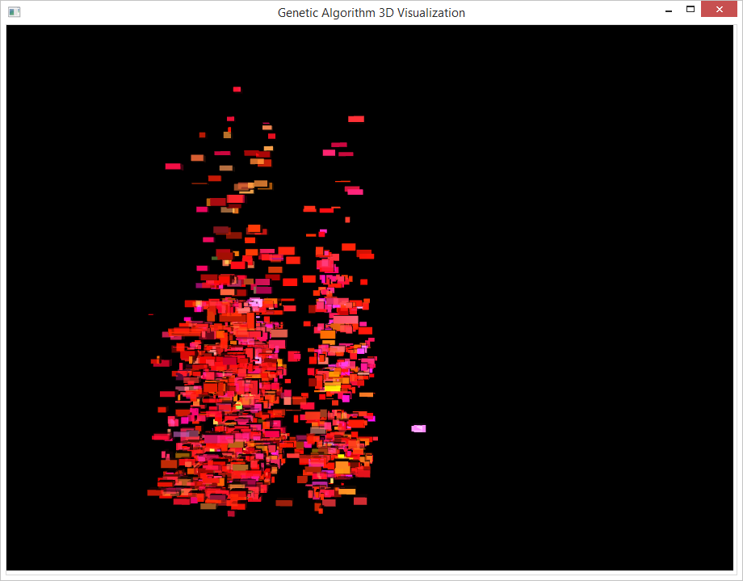
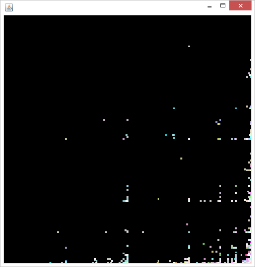
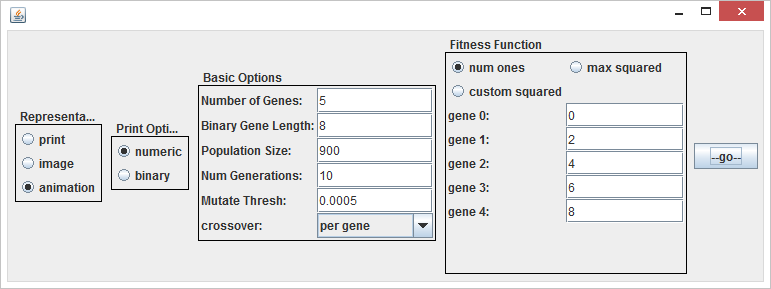

Genetic Algorithm Visualization Tool
=================
A Java program for visualizing implementations of the "Simple Genetic Algorithm."

[http://en.wikipedia.org/wiki/Genetic_algorithm](http://en.wikipedia.org/wiki/Genetic_algorithm)

### Dependencies:
JRE 1.8+

### Usage

There are currently two different user interfaces, one for visualizing the algorithm in 2D space (made in swing), and another for visualizing it in 3D space (JavaFX).

To view genetic algorithms as text, 2D images, or 2D animations, run src/swingUiDriver/init.java

To visualize the algorithm in 3D space, run src/javafxDriver/init.java

### About

More project documentation: [http://0la0.github.io/#!/projects/gaViz](http://0la0.github.io/#!/projects/gaViz)
